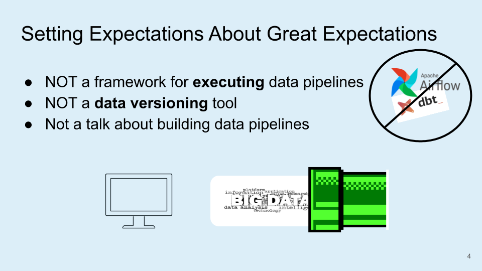

# Building Pipeline Tests to Monitor Data Quality

This document contains the slides I used to give a lightning talk to the  [Boston Python User Group](https://about.bostonpython.com/) during their event on May 16th, 2020.

I demonstrated how you can quickly set up validation tests for your data pipelines using the [Great Expectations](https://docs.greatexpectations.io/en/latest/) package in Python. 

___

Will help to address the following:

> How to convey confidence to other people about how you know what you know about your data

> Improve analytic integrity by ensuring processes around a complex situation are clearly articulated to decision makers
___

* Explain at a high-level what pipeline testing is
* Run through an example that shows how you can add pipeline testing using the Python package Great Expectations
* Next i'll show you how I incorporated Great Expectations into a personal project where I was building a small data pipeline 
* Some resources and materials that I found helpful when learning about the package
  
___

* You can think of pipeline testing as unit tests for your data
* An example of a breakage in your data pipeline could be that your engineering team changed their schema and your data pipeline wasn't expecting all of these new fields

___

Before we get going I'd like to set a few expectations up-front:
1. G.E. is not an orchestration tool. Although it integrates nicely with scheduling tools like [Airflow](https://airflow.apache.org/) or [dbt](https://www.getdbt.com/), it does not execute data pipelines for you
2. It does not store any data, rather, metadata about your data
3. Which would be awesome, but definitely warrants a longer discussion.

___

* Through it’s automated data profiling, you can quickly build a picture of your data and start exploring it much faster. Don’t need to spend the mental energy trying to figure out where to start.
    * Great for when you’re working with a new dataset you’ve never seen, or you have a new team member that needs to get up and running quickly.

* Allows you to articulate and describe how your data is “expected” to behave.
  * Similar to assertions in traditional Python unit tests.

* Can use it with pandas, run it against data in a Spark cluster, or a popular database system like Postgres / MySQL, or even a robust data warehouse like Redshift. 
  * No need to create custom components to configure different connections. It takes care of those connection properties for you out-of-the-box
  * It also integrates with orchestration engines like Airflow. So you could use the results of an expectation to fire off some Airflow job or send a Slack notification

* Great Expectations has this concept of DataDocs, which are your validation results compiled into HTML.
  *  Essentially a visual data quality report of what you expect from your data.
  * This is one of my favorite features, because you can share these with your team and it keeps everyone on the same page. * After you set up your test, when new data arrives the validation results are updated. So you’re test documentation never gets stale.

___

Can install via [PIP](https://pypi.org/project/pip/) or for those using the Anaconda distribution you can use the following `conda` command.

___

Within your current project directory you can run the command `great_expectations init` which will kick-off a new project and begin walking you through initial setup.

It also installs a new subdirectory within your current project directory.

___

Overview of the Great Expectations project directory:
* **great_expectations.yml** is where you define how to access the projects data, expectations, and validation.
* **expectations** stores data expectations (`JSON` files)
* **uncommitted** for files that *SHOULD NOT* make it to version control
  * datbase connections
  * documentation that is regenerated
  * sensitive data

**Note**: The team member who initializes a new project is the person who will need to commit the project to version control. Once committed, other team members can pull the project down and start contributing.

___

An expectation is essentially a *falsifiable and verifiable statement* about your data. This makes them extremely powerful because they provide a language to talk about data characteristics and data quality.

* These are Python methods.
* You can combine multiple expectations to create a picture of your dataset.
* Expectations generate **metadata** about your data.

___

* Metadata is stored as a dictionary
* The nice thing about this metadata is that you can access elements of the dictionary and use those values as conditional logic somewhere else in your data pipelines
  * e.g., If the `observed_value` is greater than `530`, send a Slack message to another analyst on your team for follow-up.

___

Screenshot of the documentation produced from the metadata on the previous slide. This illustrates how your expectations render human readable documentation (static `HTML`).

Your tests become your documentation.

___

For the remainder of the talk I'm going to walk you through a simple data pipeline that I've been working on to show how easy it was to work with Great Expectations out-of-the-box.